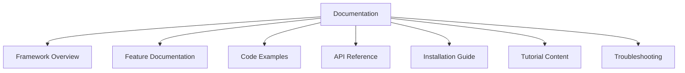

# Cacao Documentation Update Prompt

**Generate documentation updates following Cacao's documentation standards:**

## Key Documentation Components


## Example Patterns
**1. Feature Documentation**:
```python
## 🔄 Hot Reload

Cacao includes a powerful hot reload system that automatically refreshes your UI when you make changes to your code:

1. Start the development server
2. Open your browser to http://localhost:1634
3. Edit your UI code in `main.py`
4. Watch as your changes appear instantly with a smooth brown overlay animation
```

**2. Code Example**:
```python
from cacao import mix, State

# Define a reactive state
counter = State(0)

@mix("/")
def home():
    return {
        "type": "section",
        "props": {
            "children": [
                {
                    "type": "text",
                    "props": {"content": f"Count: {counter.value}"}
                },
                {
                    "type": "button",
                    "props": {
                        "label": "Increment",
                        "onClick": lambda: counter.set(counter.value + 1)
                    }
                }
            ]
        }
    }
```

## Documentation Guidelines

1. **Structure**:
   - Use clear hierarchical headings (##, ###, ####)
   - Group related content into sections
   - Start with overview, then details
   - End with examples and troubleshooting

2. **Formatting**:
   - Use emoji prefixes for section headers (🚀, ✨, 📊, etc.)
   - Include code blocks with appropriate language tags
   - Use bullet points for lists of features
   - Use numbered lists for sequential instructions
   - Add table of contents for longer documents

3. **Content Guidelines**:
   - Always include both decorator and JSON UI approaches in examples
   - Reference configuration options with example `cacao.json` snippets
   - Cross-link between related documentation sections
   - Include expected output for code examples
   - Explain rationale behind design decisions

4. **Code Examples**:
   - All examples must run without modification
   - Include imports in all code samples
   - Use type hints consistently
   - Add comments to explain complex logic
   - Follow project code style guidelines

5. **Updating Process**:
   - Review existing documentation for consistency
   - Identify gaps or outdated information
   - Update `README.md` for major features
   - Create/update specific documentation files for detailed guides
   - Cross-reference between documentation files

## Style Guide
1. Use present tense ("Cacao provides" not "Cacao will provide")
2. Prefer active voice ("Create components with..." not "Components can be created by...")
3. Be concise but complete
4. Include both simple and advanced examples
5. Reference framework conventions consistently

## Documentation Update Checklist
- [ ] Updated main features in `README.md`
- [ ] Added code examples with imports and type hints
- [ ] Updated installation instructions if needed
- [ ] Checked for broken internal links
- [ ] Verified code examples run successfully
- [ ] Added new features to appropriate documentation section
- [ ] Updated version references if applicable
- [ ] Included both basic usage and advanced patterns
- [ ] Added troubleshooting tips for common issues

## Reference Files
- README.md
- API Documentation
- Component Guide
- State Management Guide