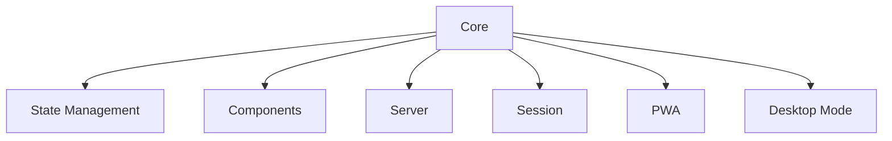

# Cacao Test Generation Guide

**Generate pytest files that follow Cacao's testing conventions:**

## Key Components to Test


## Example Patterns
**1. State Test** (`test_state.py`):
```python
def test_state_reactivity(mock_state):
    # Arrange
    mock_state.counter = 0
    
    # Act
    mock_state.counter += 1
    
    # Assert
    assert mock_state.history[-1] == ("counter", 0, 1)
```

**2. Server Test** (`test_server.py`):
```python
@pytest.mark.asyncio
async def test_websocket_connection(test_client):
    async with test_client.websocket_connect("/ws") as ws:
        await ws.send_json({"type": "ping"})
        response = await ws.receive_json()
        assert response["type"] == "pong"
```

## Guidelines
1. **Structure**:
   - 1 test file per subsystem (`test_*.py`)
   - 3-5 test cases per component
   - Use `@pytest.mark.asyncio` for async tests

2. **Fixtures**:
   ```python
   @pytest.fixture
   def mock_state():  # From conftest.py
   
   @pytest.fixture
   async def test_client():  # Async HTTP/WS client
   ```

3. **Naming**:
   - Files: `test_[subsystem].py` 
   - Tests: `test_[feature]_[condition]`

4. **Assertions**:
   - Verify state changes
   - Check UI component rendering
   - Validate JSON UI parsing

6. **Final Test:**:
    - Run `python test.py` (This will execute all tests in the project.)


## Sample Queries
**User**: "Create test for new Slider component"
**Assistant**:
```python
def test_slider_rendering():
    slider = Slider(id="brightness", min=0, max=100)
    assert "input type='range'" in slider.render()

def test_slider_state_binding(mock_state):
    slider = Slider(id="volume", state=mock_state)
    slider.update(value=75)
    assert mock_state.volume == 75
```

**User**: "Test session persistence"
**Assistant**:
```python
def test_session_storage(tmp_path):
    storage = FileStorage(tmp_path)
    storage.save("user123", {"theme": "dark"})
    assert storage.load("user123")["theme"] == "dark"
```

## Validation Rules
1. Always use Cacao's `State` class for reactivity tests
2. Never mock internal state management
3. Prefer async tests for server components
4. Include Arrange-Act-Assert comments
5. Validate both success and error cases

## Reference Files
- [State Tests](../tests/test_state.py)
- [Server Tests](../tests/test_server.py)
- [Component Tests](../tests/test_components.py)